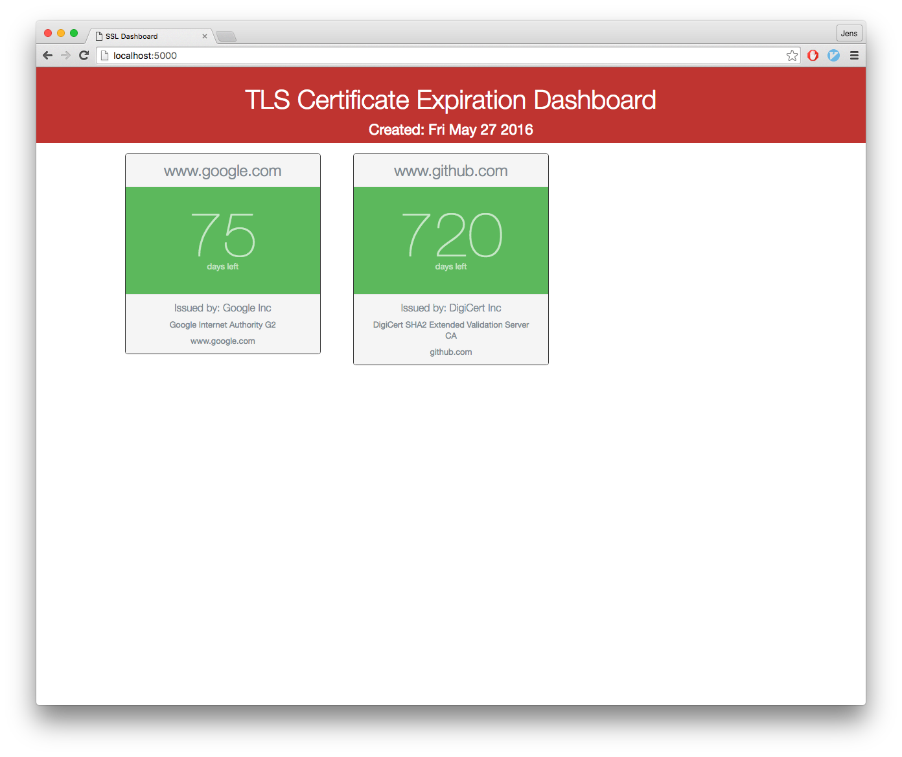

# Certificate dashboard

Responsive web app that checks when certificates will expire. Serves HTML & JSON so you can consume the service elsewhere.



## Running Locally

Make sure you have [Node.js](http://nodejs.org/) and the [Heroku Toolbelt](https://toolbelt.heroku.com/) installed.

```sh
$ npm install
$ foreman s
```

Environment variables

```sh
MONITORED_CERT_HOSTS="www.mysitethatsupportssl.com, www.othersitessl.com"
```

Your app should now be running on [localhost:5000](http://localhost:5000/).

## Deploying to Heroku

```
$ heroku create
$ git push heroku master
$ heroku config:set MONITORED_CERT_HOSTS="www.mysitethatsupportssl.com, www.othersitessl.com"
$ heroku open
```
or

[](https://heroku.com/deploy)

## Original author

I've seen a static version of this project on github, but I forgot the name of the original project. It is his static version of the dashboard turned into a configurable service that spits out HTML & JSON.
